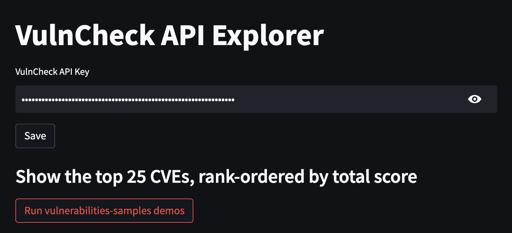

# VulnCheck API Demos and Example Code

<p align="center">
  
</p>

This repository contains a collection of demos for the [VulnCheck](https://www.vulncheck.com/) platform. 

Many of these demos are using sample data so they load faster, which is dated.

## How to use

### Streamlit demos

1. Install streamlit

```shell
    pip install streamlit
```

2. In the streamlit directory, pick a demo, then run the demo.py code, eg.

```shell
    streamlit run top25-vulns.py
```