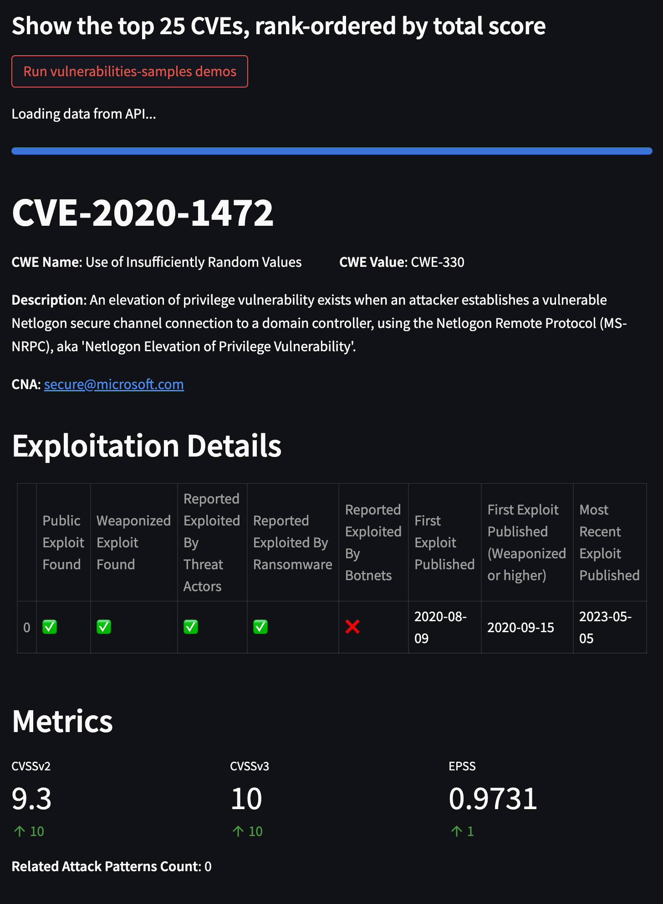

# VulnCheck API Demos and Example Code

This repository contains a collection of demos for the [VulnCheck](https://www.vulncheck.com/) platform. 

Many of these demos are using sample data so they load faster, which is dated.

## How to use

### Streamlit demos

1. Install streamlit

```shell
    pip install streamlit
```

2. In the streamlit directory, pick a demo, then run the demo.py code, eg.

```shell
    streamlit run top25-vulns.py
```

---

#### top25-vulns.py

Processes the vulncheck vulnerabilities-samples feed, displaying the top 25 vulnerabilities
rank ordered by CVSS, EPSS, and pulls in additional data from the vulncheck v3 exploits index.

<p align="center">
    
</p>
